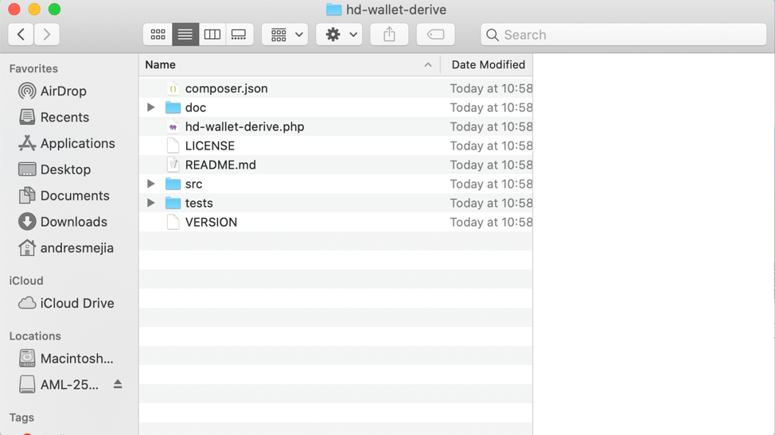
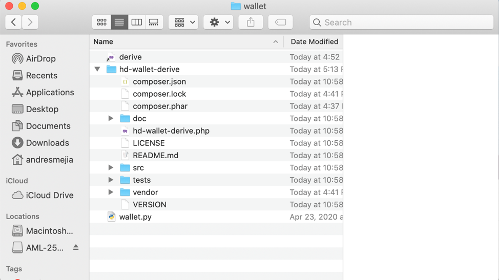
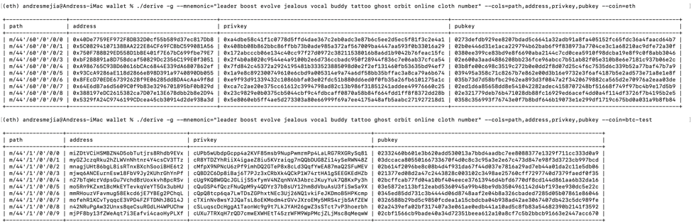
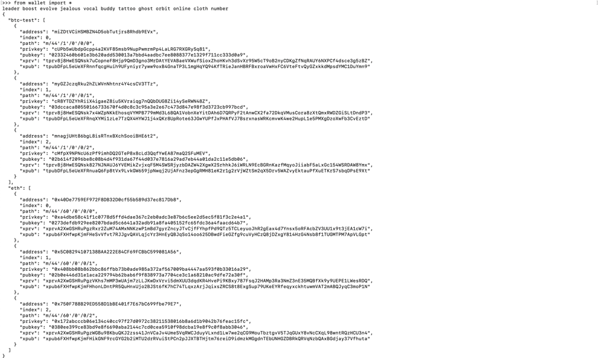
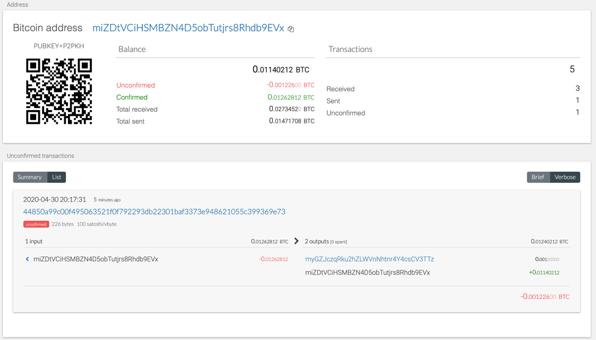
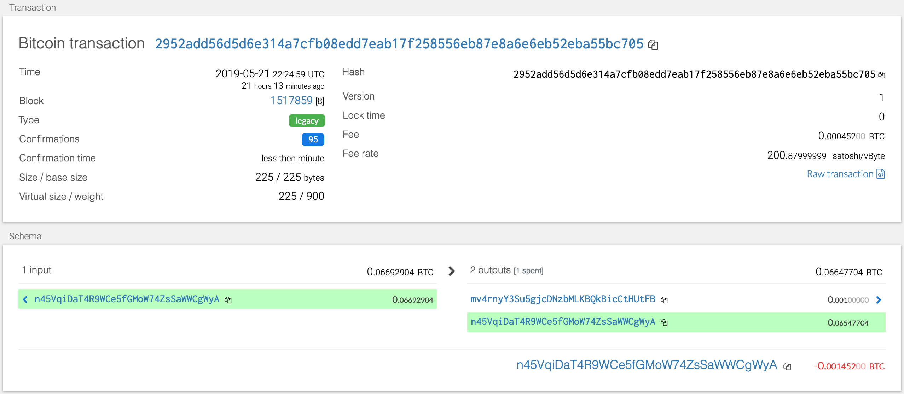
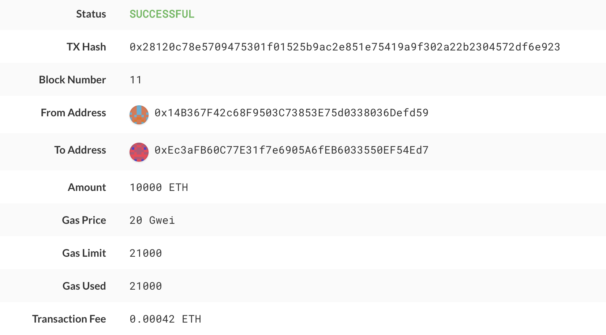

# Multi-Blockchain Wallet in Python


## hd-wallet-derive

hd-wallet-derive is a command-line tool to manage Bitcoin, ETH and other crypto currencies in a single place.

To be able to work with hd-wallet-derive, the following steps were done:

## Instructions

1. hd-Wallet and dependencies installation (in a new directory "wallet"):
      
        brew install php@7.2
        export PATH=/usr/local/opt/php@7.2/bin:$PATH
        echo "export PATH=/usr/local/opt/php@7.2/bin:$PATH" >> ~/.bash_profile
        
        git clone https://github.com/dan-da/hd-wallet-derive
        cd hd-wallet-derive
        php -r "readfile('https://getcomposer.org/installer');" | php
        
        php -d pcre.jit=0 composer.phar install
        
        ln -s hd-wallet-derive.php derive

Before:


After:



2. Testing:
./derive -g --mnemonic="leader boost evolve jealous vocal buddy tattoo ghost orbit online cloth number" --cols=path,address,privkey,pubkey



3. Create the .env file in wallet directory:

MNEMONIC=" leader boost evolve jealous vocal buddy tattoo ghost orbit online cloth number"



4. Install bit and web3 libraries using pip (included in requirements.txt file

5. The following Python files were created to interact with hd-wallet functionallity:
        
          constants.py
          wallet.py

5. once intalled hd-wallet-derive, in a python command line:

          from wallet import *
          


### Project setup

- Create a project directory called `wallet` and `cd` into it.

- Clone the `hd-wallet-derive` tool into this folder and install it using the instructions on its `README.md`.

- Create a symlink called `derive` for the `hd-wallet-derive/hd-wallet-derive.php` script into the top level project
  directory like so: `ln -s hd-wallet-derive/hd-wallet-derive.php derive`

  This will clean up the command needed to run the script in our code, as we can call `./derive`
  instead of `./hd-wallet-derive/hd-wallet-derive.php`.

- Test that you can run the `./derive` script properly, use one of the examples on the repo's `README.md`

- Create a file called `wallet.py` -- this will be your universal wallet script.

Your directory tree should look something like this:


### Setup constants

- In a separate file, `constants.py`, set the following constants:
  - `BTC = 'btc'`
  - `ETH = 'eth'`
  - `BTCTEST = 'btc-test'`

- In `wallet.py`, import all constants: `from constants import *`

- Use these anytime you reference these strings, both in function calls, and in setting object keys.

### Generate a Mnemonic

- Generate a new 12 word mnemonic using `hd-wallet-derive` or by using [this tool](https://iancoleman.io/bip39/).

- Set this mnemonic as an environment variable, and include the one you generated as a fallback using:
  `mnemonic = os.getenv('MNEMONIC', 'insert mnemonic here')`

### Deriving the wallet keys

- Use the `subprocess` library to call the `./derive` script from Python. Make sure to properly wait for the process.

- The following flags must be passed into the shell command as variables:
  - Mnemonic (`--mnemonic`) must be set from an environment variable, or default to a test mnemonic
  - Coin (`--coin`)
  - Numderive (`--numderive`) to set number of child keys generated

- Set the `--format=json` flag, then parse the output into a JSON object using `json.loads(output)`

- You should wrap all of this into one function, called `derive_wallets`

- Create an object called `coins` that derives `ETH` and `BTCTEST` wallets with this function.
  When done properly, the final object should look something like this (there are only 3 children each in this image):


You should now be able to select child accounts (and thus, private keys) by calling `coins[COINTYPE][INDEX]['privkey']`.

### Linking the transaction signing libraries

Now, we need to use `bit` and `web3.py` to leverage the keys we've got in the `coins` object.
You will need to create three more functions:

- `priv_key_to_account` -- this will convert the `privkey` string in a child key to an account object
  that `bit` or `web3.py` can use to transact.
  This function needs the following parameters:

  - `coin` -- the coin type (defined in `constants.py`).
  - `priv_key` -- the `privkey` string will be passed through here.

  You will need to check the coin, then return one of the following functions based on the library:

  - For `ETH`, return `Account.privateKeyToAccount(priv_key)`
  - For `BTCTEST`, return `PrivateKeyTestnet(priv_key)`

- `create_tx` -- this will create the raw, unsigned transaction that contains all metadata needed to transact.
  This function needs the following parameters:

  - `coin` -- the coin type (defined in `constants.py`).
  - `account` -- the account object from `priv_key_to_account`.
  - `to` -- the recipient address.
  - `amount` -- the amount of the coin to send.

  You will need to check the coin, then return one of the following functions based on the library:

  - For `ETH`, return an object containing `to`, `from`, `value`, `gas`, `gasPrice`, `nonce`, and `chainID`.
    Make sure to calculate all of these values properly using `web3.py`!
  - For `BTCTEST`, return `PrivateKeyTestnet.prepare_transaction(account.address, [(to, amount, BTC)])`

- `send_tx` -- this will call `create_tx`, sign the transaction, then send it to the designated network.
  This function needs the following parameters:

  - `coin` -- the coin type (defined in `constants.py`).
  - `account` -- the account object from `priv_key_to_account`.
  - `to` -- the recipient address.
  - `amount` -- the amount of the coin to send.

  You may notice these are the exact same parameters as `create_tx`. `send_tx` will call `create_tx`, so it needs
  all of this information available.

  You will need to check the coin, then create a `raw_tx` object by calling `create_tx`. Then, you will need to sign
  the `raw_tx` using `bit` or `web3.py` (hint: the account objects have a sign transaction function within).

  Once you've signed the transaction, you will need to send it to the designated blockchain network.

  - For `ETH`, return `w3.eth.sendRawTransaction(signed.rawTransaction)`
  - For `BTCTEST`, return `NetworkAPI.broadcast_tx_testnet(signed)`

### Send some transactions!

Now, you should be able to fund these wallets using testnet faucets. Open up a new terminal window inside of `wallet`,
then run `python`. Within the Python shell, run `from wallet import *` -- you can now access the functions interactively.
You'll need to set the account with  `priv_key_to_account` and use `send_tx` to send transactions.

#### Bitcoin Testnet transaction

- Fund a `BTCTEST` address using [this testnet faucet](https://coinfaucet.eu/en/btc-testnet/).

- Use a [block explorer](https://tbtc.bitaps.com/) to watch transactions on the address.

- Send a transaction to another testnet address (either one of your own, or the faucet's).

- Screenshot the confirmation of the transaction like so:



#### Local PoA Ethereum transaction

- Add one of the `ETH` addresses to the pre-allocated accounts in your `networkname.json`.

- Delete the `geth` folder in each node, then re-initialize using `geth --datadir nodeX init networkname.json`.
  This will create a new chain, and will pre-fund the new account.

- [Add the following middleware](https://web3py.readthedocs.io/en/stable/middleware.html#geth-style-proof-of-authority)
  to `web3.py` to support the PoA algorithm:

```
from web3.middleware import geth_poa_middleware

w3.middleware_onion.inject(geth_poa_middleware, layer=0)
```

- Due to a bug in `web3.py`, you will need to send a transaction or two with MyCrypto first, since the
  `w3.eth.generateGasPrice()` function does not work with an empty chain. You can use one of the `ETH` address `privkey`,
  or one of the `node` keystore files.

- Send a transaction from the pre-funded address within the wallet to another, then copy the `txid` into
  MyCrypto's TX Status, and screenshot the successful transaction like so:



### Submission

- Create a `README.md` that contains the test transaction screenshots, as well as the code used to send them.
  Pair the screenshot with the line(s) of code.

- Write a short description about what the wallet does, what is is built with, and how to use it.

- Include installing pip dependencies using `requirements.txt`, as well as cloning and installing `hd-wallet-derive`.
  You may include the `hd-wallet-derive` folder in your repo, but still include the install instructions. You do not
  need to include Python or PHP installation instructions.

- Upload the project to a new GitHub repository.

- Celebrate the fact that you now have an incredibly powerful wallet that you can expand to hundreds of coins!

### Challenge Mode

- Add support for `BTC`.

- Add support for `LTC` using the sister library, [`lit`](https://github.com/blockterms/lit).

- Add a function to track transaction status by `txid`.
