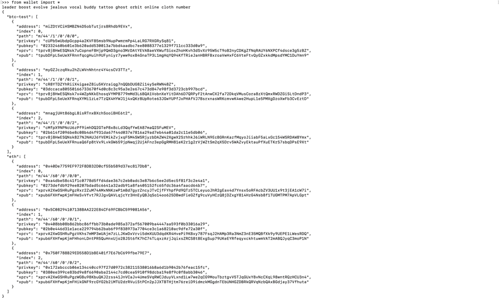
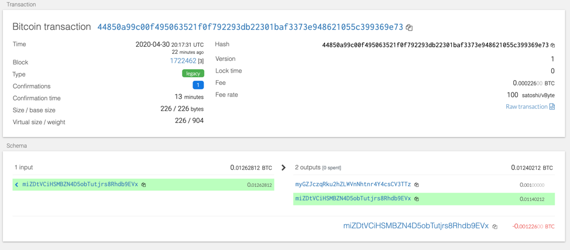
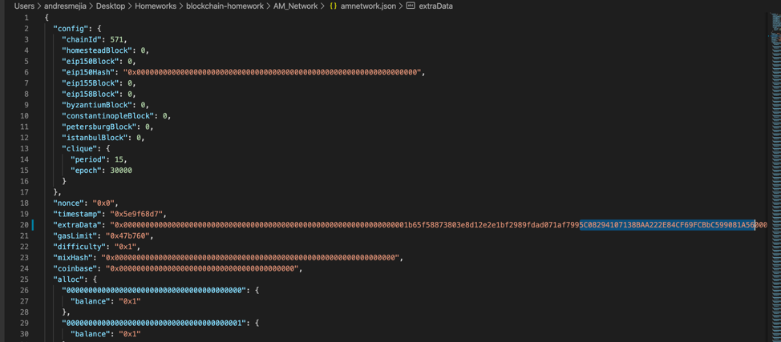
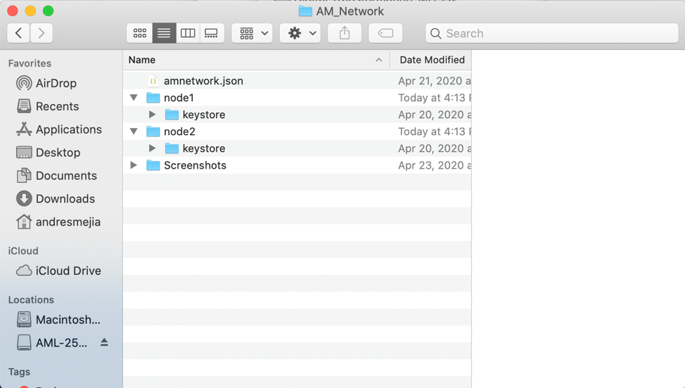
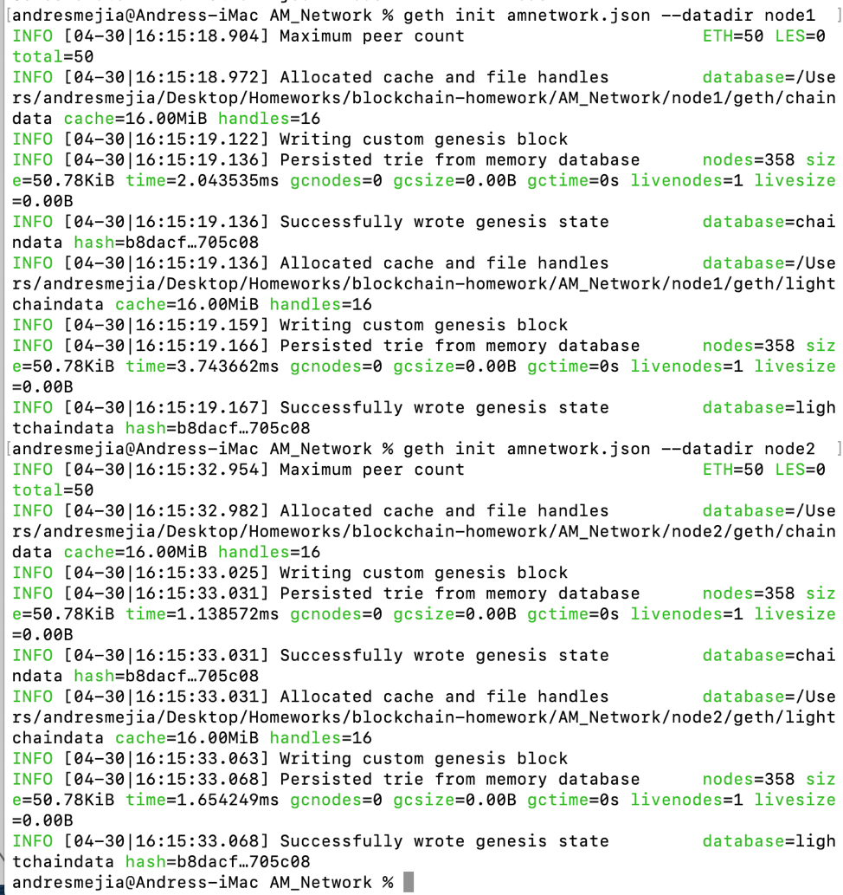
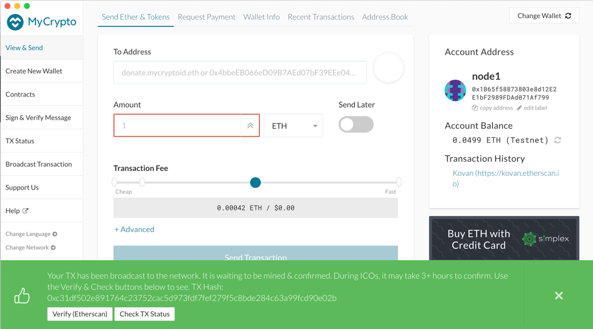
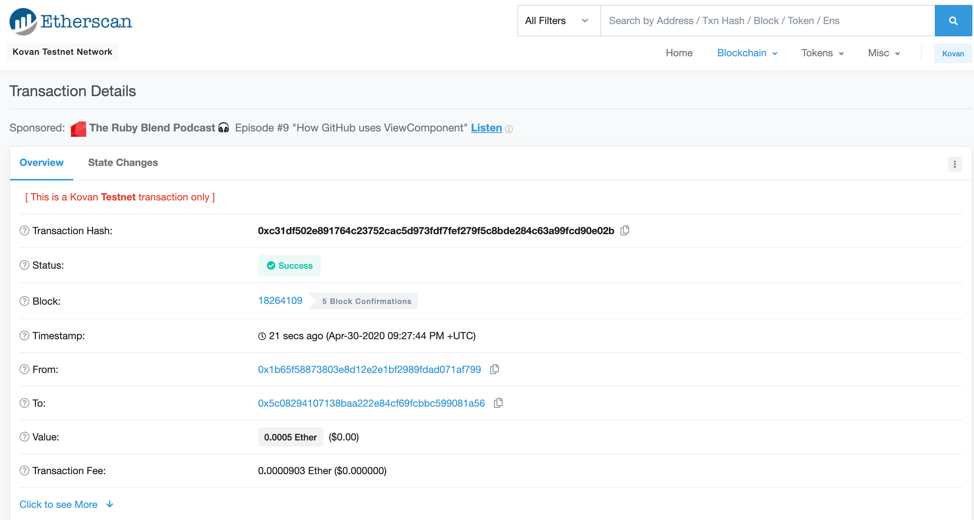

# Multi-Blockchain Wallet in Python

## hd-wallet-derive

hd-wallet-derive is a command-line tool to manage Bitcoin, ETH and other crypto currencies in a single place.

To be able to work with hd-wallet-derive, the following steps were done:

## Instructions

1. hd-Wallet and dependencies installation (in a new directory "wallet"):
      
        brew install php@7.2
        export PATH=/usr/local/opt/php@7.2/bin:$PATH
        echo "export PATH=/usr/local/opt/php@7.2/bin:$PATH" >> ~/.bash_profile
        
        git clone https://github.com/dan-da/hd-wallet-derive
        cd hd-wallet-derive
        php -r "readfile('https://getcomposer.org/installer');" | php
        
        php -d pcre.jit=0 composer.phar install
        
        ln -s hd-wallet-derive.php derive

Before:

After:

2. Testing:
./derive -g --mnemonic="leader boost evolve jealous vocal buddy tattoo ghost orbit online cloth number" --cols=path,address,privkey,pubkey

3. Create the .env file in wallet directory:

MNEMONIC=" leader boost evolve jealous vocal buddy tattoo ghost orbit online cloth number"

4. Install bit and web3 libraries using pip (included in requirements.txt file

5. The following Python files were created to interact with hd-wallet functionallity:
        
          constants.py
          wallet.py

5. Once intalled hd-wallet-derive, in a python command line:

          from wallet import *
          

6. Assign account to a new variable in Python, using the 1st Private Key from BTC-Test:

          ACT=priv_key_to_account (BTCTEST,"cUPb5wUbdpGcpp4a2KVF85msb9NupPwmrmPp4LaLRG7RXGRySq81")

7. Send a test transaction to the 2nd address in BTC-Test:

          send_tx (BTCTEST, ACT, "myGZJczqRku2hZLWVnNhtnr4Y4csCV3TTz", 0.001)

8. Transaction in https://tbtc.bitaps.com/miZDtVCiHSMBZN4D5obTutjrs8Rhdb9EVx

9. Adding the 2nd address in ETH to amnetwork.json file:

10. Delete the geth folder in each node, then re-initialize using geth --datadir nodeX init networkname.json. This will create a new chain, and will pre-fund the new account:

Inizializing nodes:

11. Transfer in MyCrypto:

The following are the available functions in the wallet.py code:

      priv_key_to_account (coin, priv_key) : Converts a private key to an account format
      create_tx (coin, account, to, amount) : Function used by send_tx to create a transaction
      send_tx (coin, account, to, amount) : Function to send transactions in a specific coin from an Account to an address
